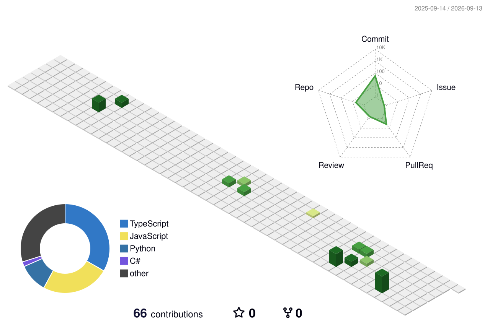

# Hi, I'm IronJ 👋

Building practical tools with Python and JavaScript.

### About me :octocat:

- 🐍 I build automation and developer tools with Python.
- 🌐 I also work with JavaScript for useful web applications.
- 🛠️ I enjoy turning everyday problems into small, practical projects.

### Featured projects 🚀

- [Postgraduate Recommendation Score Assistant](https://github.com/duduking19/Postgraduate-Recommendation-Score-Assitant) — a JavaScript-based score assistant.
- [XMUOJ Helper](https://github.com/duduking19/xmuoj_helper) — a Python helper for XMUOJ.
- [XMU Rollcall Bot Integrated](https://github.com/duduking19/XMU-Rollcall-Bot-Integrated) — an integrated roll-call CLI with QR scanning and Telegram notifications.

### Metrics 📈

### Contribution graph 🌱

