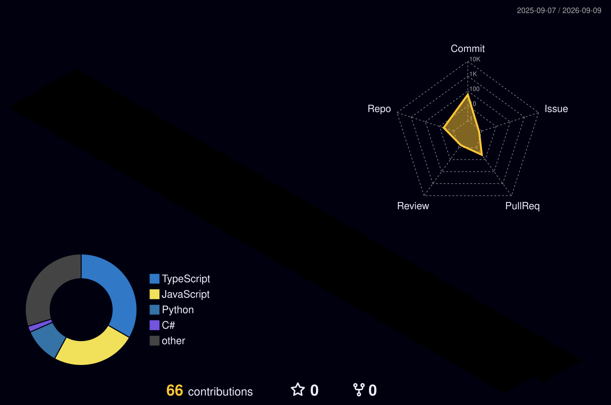

<!-- GitHub profile README -->

# IronJ 👋

Python · JavaScript · Practical Tools

### 个人介绍 / About me :octocat:

<kbd>🇨🇳 中文</kbd>

 

- 🐍 使用 Python 开发自动化工具和开发者工具。
- 🌐 使用 JavaScript 构建实用的 Web 应用。
- 🛠️ 喜欢把日常遇到的问题转化为简单、实用的项目。

<kbd>🇬🇧 English</kbd>

 

- 🐍 I build automation and developer tools with Python.
- 🌐 I also work with JavaScript for useful web applications.
- 🛠️ I enjoy turning everyday problems into small, practical projects.

### GitHub 数据统计 / Metrics 📈

### 3D 贡献图 / Contribution graph 🌱

